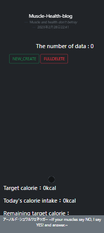
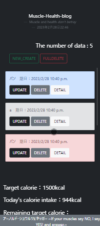

# What is "KAROPRO"

本アプリは摂取したカロリーを記録し、可視化するサービスであり、
カロリーコントロールするためのWebアプリケーションである。

# Description

彼女が健康と筋トレに意識を向ける中で、貢献できる何らかのサービスを提供したいと考え、開発したものです。本アプリでは、目標カロリーの設定、飲食内容の記録、カロリー算出、目標カロリーと現在の摂取カロリーとの差の表示、および可視化を主な機能として実装しています。なお、本プロダクトの開発には、Djangoを用いたフレームワークが採用されました。

今後は、体重とBMIの管理機能や歩数計との連携による消費カロリーの表示機能などを追加し、より充実した機能性を実現する予定です。また、健康や筋トレに関する最新情報やニュースの表示機能も検討しており、ユーザーの健康維持に役立つサービスとして、今後も改良を重ねていく予定です。

＊公開していない

＊セキュリティ対策のためSECRET_KEYは***で隠している。

# DEMO


作成ウェブページ




# Requirement

* Windows10 Home
* conda == 22.9.0
* conda-build == 3.22.0
* python == 3.9.13
* Django==4.1.6
* django-environ==0.9.0
* ubuntu-advantage-tools==8001
* ubuntu == 20.04
* virtualenv==20.19.0

# Installation

[Anaconda](https://www.anaconda.com/products/distribution)のサイトのダウンロードページからWindows用のPython3.9 64bit Graphical Installerをダウンロードする(Anacondaをインストール完了することでpythonの利用可能)。

1. ubuntuのダウンロード(ubuntu 20.04 LTS)
2. Djangoを用いて開発を行うにあたって仮想環境構築。 [こちら](https://www.sejuku.net/blog/68398)が参考サイト。

Djangoの始め方仮想環境構築などは[udemy](https://www.sejuku.net/blog/68398)を利用して勉強した。

[この動画](https://www.sejuku.net/blog/68398)を見れば誰でも環境の構築が出来ると思う。


virtualenvのインストール
```bash
sudo pip install virtualenv
```

仮想環境を構築
```bash
virtualenv -p python3 venv
```

仮想環境の立ち上げ
```bash
source venv/bin/activate
```

Djangoのインストール>>>djangoの[公式サイト](https://docs.djangoproject.com/ja/4.0/)
```bash
pip install Django
```


# Usage


```bash
git clone https://github.com/KAROPRO/~

python manage.py runserver
```

# Author


* Sora Nakaza
* NIT
* s202065@nishitech.ac.jp

# License

"hoge" is under [MIT license](https://en.wikipedia.org/wiki/MIT_License).
