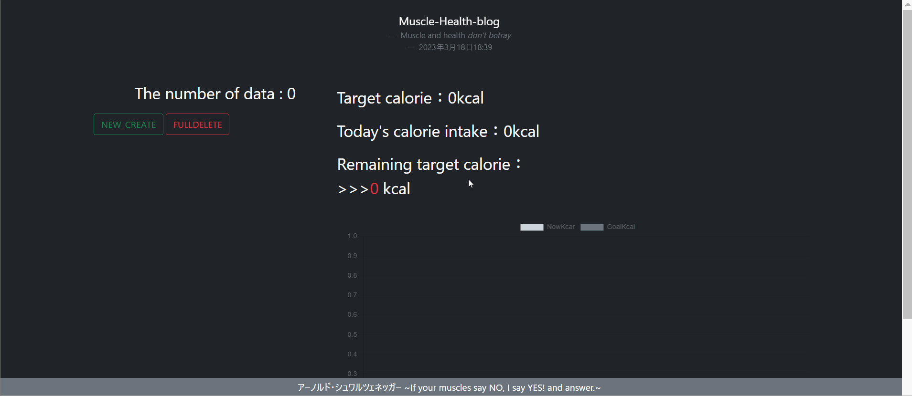

# KAROPRO

KAROPROとは目標カロリーを設定しそれを目指していくサイト。

# Description

彼女が最近筋トレや健康を意識しており、それの何か貢献できるモノを作りたいと考え作成したのがこのKAROPRO。

今回は目標カロリーの設定、食べたものとそのカロリーの記録、目標カロリーと現在摂取カロリーとの差、グラフ化などを中心に作成した。

今後は、体重とBMI管理、歩数アプリとの接続で消費カロリーの表示、最近の健康系、筋トレ系ニュースの表示などを加え改良していきたいと考えている。

フレームワークはDjangoを使用。

＊公開していない

＊セキュリティ対策のためSECRET_KEYは***で隠している。

# DEMO


作成ウェブページ




# Requirement

* Windows10 Home
* conda == 22.9.0
* conda-build == 3.22.0
* python == 3.9.13
* Django==4.1.6
* django-environ==0.9.0
* ubuntu-advantage-tools==8001
* ubuntu == 20.04
* virtualenv==20.19.0

# Installation

[Anaconda](https://www.anaconda.com/products/distribution)のサイトのダウンロードページからWindows用のPython3.9 64bit Graphical Installerをダウンロードする(Anacondaをインストール完了することでpythonの利用可能)。

1. ubuntuのダウンロード(ubuntu 20.04 LTS)
2. Djangoを用いて開発を行うにあたって仮想環境構築。 [こちら](https://www.sejuku.net/blog/68398)が参考サイト。

Djangoの始め方仮想環境構築などは[udemy](https://www.sejuku.net/blog/68398)を利用して勉強した。

[この動画](https://www.sejuku.net/blog/68398)を見れば誰でも環境の構築が出来ると思う。


virtualenvのインストール
```bash
sudo pip install virtualenv
```

仮想環境を構築
```bash
virtualenv -p python3 venv
```

仮想環境の立ち上げ
```bash
source venv/bin/activate
```

Djangoのインストール>>>djangoの[公式サイト](https://docs.djangoproject.com/ja/4.0/)
```bash
pip install Django
```


# Usage


```bash
git clone https://github.com/KAROPRO/~

python manage.py runserver
```

# Note

まだ公開できていない

本来ならサーバー(AWSやお名前.comなど)をかりてデプロイしたいが、
まだまだweb周りの知識不足なので自分で1から構築してみてデプロイする予定。

# Author


* 仲座空良
* 西日本工業大学　工学部　総合システム工学科　武村研究室所属
* s202065@nishitech.ac.jp

# License

"hoge" is under [MIT license](https://en.wikipedia.org/wiki/MIT_License).
